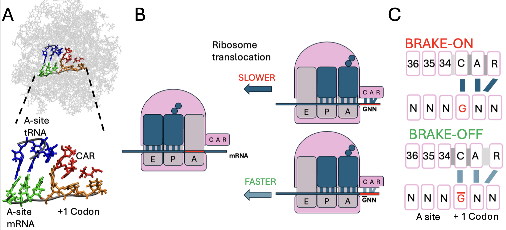

# A set of tools for performing systems analyses of Molecular Dynamics (MD) Simulations


[]()
[]()

[]()


# Introducing the Pipeline:


Pictured is a directed graph describing the core of our pipeline for trajectory analysis. From left to right, we begin with a trajectory file, convert it into networks, which can be represented as either graphs or adjacency matrices. We move forward with the adjacency matrix representations and concatenate each matrix’s rows to create a vector representation of our system at every frame. Next, we vertically concatenate these to create a feature matrix that can be used as input to either K-means or PCA, whose results can then be visualized using the principal components analysis, our MDcircos plots, or replicate maps (which can alternatively represent the raw H-bond counts).

# The easiest way to get going is to pip install from the repository. This will be replaced with a proper pyPI install very soon but, at the moment we are still in development.

```bash

#At the moment you can pip install directly from our repo
pip install git+https://github.com/zeper-eng/workspace.git

###############
#Alternatively#
###############

# First fork the repository over 
git clone https://github.com/zeper-eng/workspace.git
cd workspace

#Now from inside of the workspace folder simply pip install!

pip install .

#Regardless of the python environment you should be good to go
pip show workspace

```

# Some context on the labs current focus: computational genetics expirements.


At the Weir Lab at Wesleyan University, we perform molecular dynamics simulations of a ribosomal subsystem to study protein translation and the CAR interaction surface—a recently discovered ribosomal interface identified by the lab. Our research focuses on modifying adjacent codon identities at the A-site and the +1 position (poised to enter the A-site in the 5'→3' direction) to model how changes at these sites influence the behavior of the CAR surface and correlate with translation rate variations.


